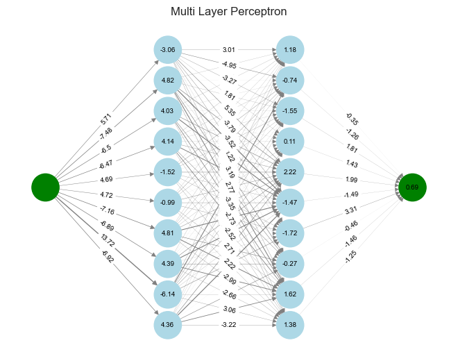
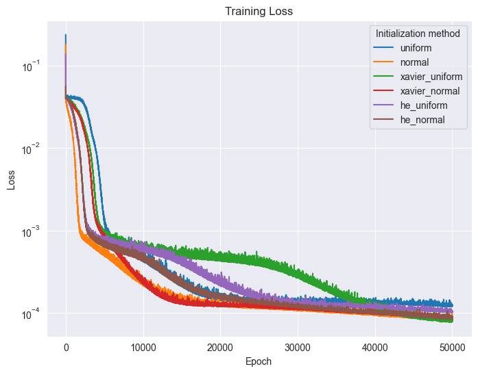

# Neural Networks from Scratch

<div align="center">
    
    
</div>


## Overview

This is a small educational repository that provides a hands-on experience in understanding the fundamental concepts of neural networks written with NumPy. The repository allows you to experiment with various neural network architectures, activation functions, optimization algorithms, and regularization techniques, all with a PyTorch-inspired API.

By using this repository, you can gain valuable insights into the inner workings of neural networks and get a clearer understanding of how different components of the network affect its performance on various tasks. Feel free to experiment with different configurations, datasets, and optimization techniques to gain a deeper understanding of neural networks.

## Features

This repository offers the following features:

* Multi-Layer Perceptrons (MLP) with customizable configurations.
* Training using backpropagation to optimize network parameters.
* Different weight initialization methods for exploring their impact on convergence.
* A variety of activation functions to experiment with non-linearity.
* Various optimization algorithms, including SGD, Momentum, RMSprop and Adam to compare training efficiency.
* Regression and classification toy datasets for testing the neural networks.
* Regularization techniques such as early stopping and L2 regularization to prevent overfitting.

## Installation

```bash
git clone https://github.com/mpiorczynski/neural-networks-from-scratch
cd neural-networks-from-scratch
pip install -r requirements.txt
```

## Usage

```python
import numpy as np
import miowad.nn as nn

# Create a neural network with 2 hidden layers
model = nn.Sequential([
    nn.Linear(1, 10),
    nn.Sigmoid(),
    nn.Linear(10, 10),
    nn.Sigmoid(),
    nn.Linear(10, 1),
])

# Initialize model weights
model.init_weights('xavier_uniform')

# Define the loss function and optimizer
criterion = nn.CrossEntropyLoss()
optimizer = nn.optimizers.SGD(model.parameters, lr=1e-2)

# Create trainer object
trainer = nn.Trainer(model, optimizer, criterion)

# Train the model on a toy dataset
X_train, y_train = np.random.randn(100, 2), np.random.randint(0, 2, size=(100, 1))
trainer.train(X_train, y_train, num_epochs=100, batch_size=32, log_every=10)
```

To get started, you can explore the provided Jupyter Notebook examples in the `notebooks/` folder. Each notebook showcases a specific aspect of neural networks and demonstrates how to use the implemented functionality.